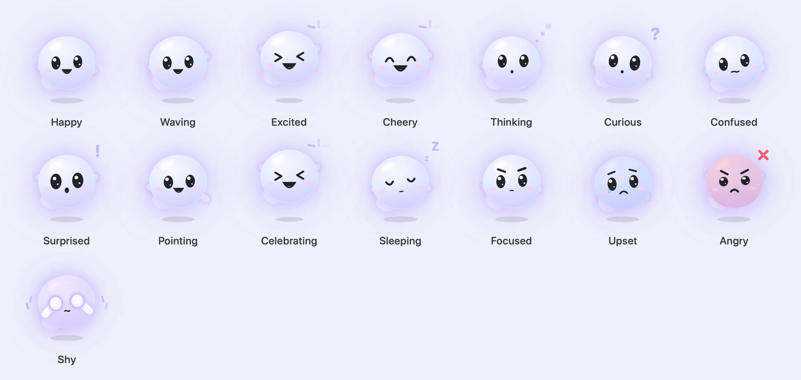
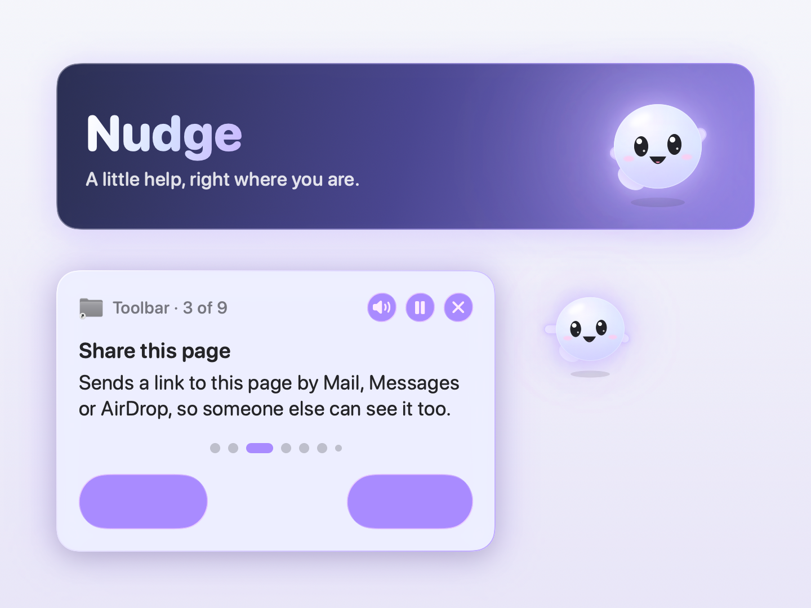
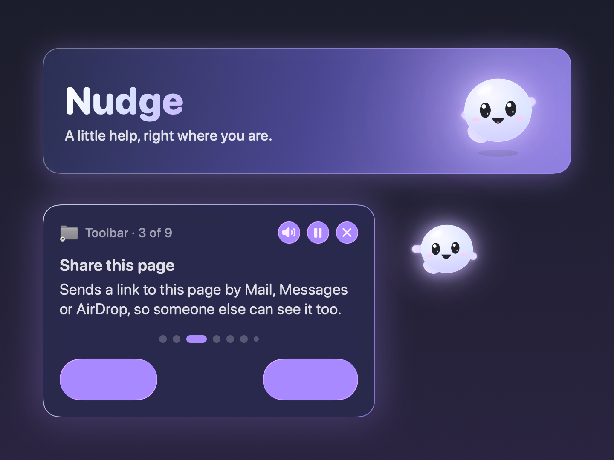
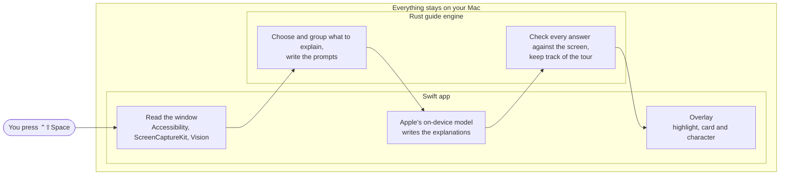

<p align="center">
  
</p>

<h1 align="center">Nudge</h1>

<p align="center">
  <strong>Just show me where.</strong><br>
  A friendly guide that explains any Mac app or website, one step at a time.<br>
  Made for people who find computers confusing, and it never sends your screen anywhere.
</p>

<p align="center">
  <a href="https://github.com/Ezra-Black/nudge/actions/workflows/ci.yml"></a>
  <a href="LICENSE"></a>
  
  
  
</p>

---

Press a shortcut in any app, and Nudge reads the window, then walks you through it: a soft highlight on each button, a large, plain-language card saying what it does and why you'd use it, and a little character floating beside it so your eyes know where to look. Everything happens on your Mac, using Apple's on-device model. Nothing is uploaded, ever.

## What Nudge does

- **Explains the whole window.** Toolbars, sidebars, buttons, links, fields and menus, in reading order, with an overview first. On a website, it says where each link goes.
- **Explains just one part.** Press <kbd>⌃</kbd><kbd>⇧</kbd><kbd>A</kbd>, drag a box around anything, and Nudge explains only what's inside: its buttons, then its pictures, then its text, block by block.
- **Sees pictures.** Inside a chosen area, Nudge looks at photos and images on your Mac and says what they seem to show: "That's a photo of a dog."
- **Helps you do something.** Type a goal like "print this page", and Nudge shows the next step, waits for you to do it, then shows the one after.
- **Groups what belongs together.** A calculator's number keys are one stop, not ten.
- **Is easy on the eyes.** Big text and buttons, a dimmed background, a highlight that follows the window as it moves, Space to go on, read-aloud with pause and stop, and calm motion that respects Reduce Motion.
- **Asks how it did.** At the end of each guide, Nudge asks "Did I do good?" If not, you can tell him what went wrong. Your answer stays on your Mac.
- **Is yours to style.** Colors, fonts, text size, highlight, glow, dimming, sounds and the character's size, with a live preview.

<p align="center">
  
  
</p>

## Privacy

Nudge is built so that it *can't* share what's on your screen:

- **No network code.** The app has no HTTP client, no server, no analytics and no crash reporting.
- **On-device intelligence only.** Explanations come from Apple's on-device Foundation Models. Text in pictures is read with Apple's Vision framework, on your Mac.
- **Reads only when asked.** Nudge looks at a window only after you press its shortcut, and only while a guide is on screen. Password fields are never read.
- **Remembers nothing about your screen.** Screen content and guides are kept in memory, then discarded. The only file Nudge writes is your "Did I do good?" feedback, which stays on your Mac.
- **Guides; never acts.** Nudge never clicks, types or changes anything for you.

## Get Nudge

| | |
|---|---|
| **Official app** | The signed, ready-to-use app, with automatic updates, for one simple price. *Coming soon.* |
| **Build it yourself** | Free for your own use. Follow the steps below. |

Buying the official app is the best way to support Nudge's development.

### Requirements

- A Mac with Apple silicon, running **macOS 26** or later, with **Apple Intelligence** turned on (Nudge uses its on-device model)
- To build: **Xcode 26** (Swift 6.2) and **Rust** (install with [rustup](https://rustup.rs))

### Build from source

```sh
git clone https://github.com/Ezra-Black/nudge.git
cd nudge
cp .env.example .env      # optional: set a signing identity, see below
make run                  # builds build/Nudge.app and opens it
```

On first launch, Nudge gives you a short tour of itself, then helps you turn on two permissions in **System Settings → Privacy & Security**:

- **Accessibility**, so Nudge can find the buttons and links in a window.
- **Screen Recording** (optional), so Nudge can read text and pictures that apps don't describe. macOS applies this after Nudge reopens.

> [!TIP]
> macOS ties these permissions to the app's code signature. Builds signed ad-hoc (the default) need them granted again after every rebuild. Set `NUDGE_SIGN_IDENTITY` in `.env` to your own Apple Development identity (`security find-identity -v -p codesigning` lists them) and they'll stick.

Run `make help` to see every task: `build`, `run`, `test`, `lint`, `format` and `clean`.

## Using Nudge

| Shortcut | What it does |
|---|---|
| <kbd>⌃</kbd><kbd>⇧</kbd><kbd>Space</kbd> | Explain the window you're in. Press again to pause, and again to resume. |
| <kbd>⌃</kbd><kbd>⇧</kbd><kbd>A</kbd> | Drag a box around part of the screen to have it explained. |
| <kbd>Space</kbd> / <kbd>⇧</kbd><kbd>Space</kbd> | Next step / previous step |
| <kbd>⌃</kbd><kbd>⇧</kbd><kbd>→</kbd> / <kbd>⌃</kbd><kbd>⇧</kbd><kbd>←</kbd> | Next step / previous step, even while typing |
| <kbd>Esc</kbd> | Close the guide |

Both shortcuts can be changed in Nudge's settings, which you can open from the menu bar.

## How it works



The app is SwiftUI and AppKit, organized as models, view models, views and services. The guide engine is a small Rust program the app runs privately over standard input and output; it has no platform code, so a Windows version could reuse it. Read [docs/ARCHITECTURE.md](docs/ARCHITECTURE.md) for the full tour and [docs/PROTOCOL.md](docs/PROTOCOL.md) for the engine protocol.

```
Sources/Nudge/
├── App/          entry point and menu bar
├── Models/       plain data: observations, guides, settings, appearance
├── ViewModels/   AppController (the guide session) and the card's GuideModel
├── Views/        SwiftUI: the guide card and the settings window
├── Services/     screen reading, on-device model, engine bridge, speech, sound, feedback
├── Platform/     AppKit windows: the overlay, the area selector, global shortcuts
├── Support/      small extensions and logging
└── Brand/        the Nudge character and icons (not open source, see below)
engine/           the Rust guide engine
Tests/            Swift tests (the engine's tests live in engine/tests)
docs/             architecture, protocol, testing and images
```

## Contributing

Contributions are very welcome, from bug reports to new features. Please read [CONTRIBUTING.md](CONTRIBUTING.md) first; it explains how to get set up, the few rules that keep Nudge private and kind, and how to send a pull request. Everyone taking part is expected to follow the [Code of Conduct](CODE_OF_CONDUCT.md).

Found a security or privacy problem? Please don't open a public issue. See [SECURITY.md](SECURITY.md).

## License and trademarks

Nudge's **source code** is licensed under the [Apache License 2.0](LICENSE). You're free to use, study, change and share it.

The **Nudge name and character are not**. They're trademarks of Ezra Black, and the files that draw the character and its artwork are covered by the separate [Nudge Brand License](LICENSE-BRAND.md). You can build and run Nudge with them for yourself, but a fork you publish needs its own name and character. [TRADEMARKS.md](TRADEMARKS.md) explains what's fine and how to make a fork.
