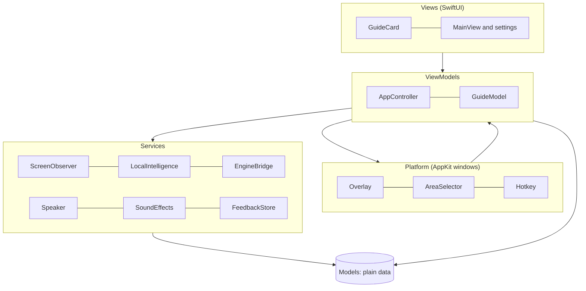
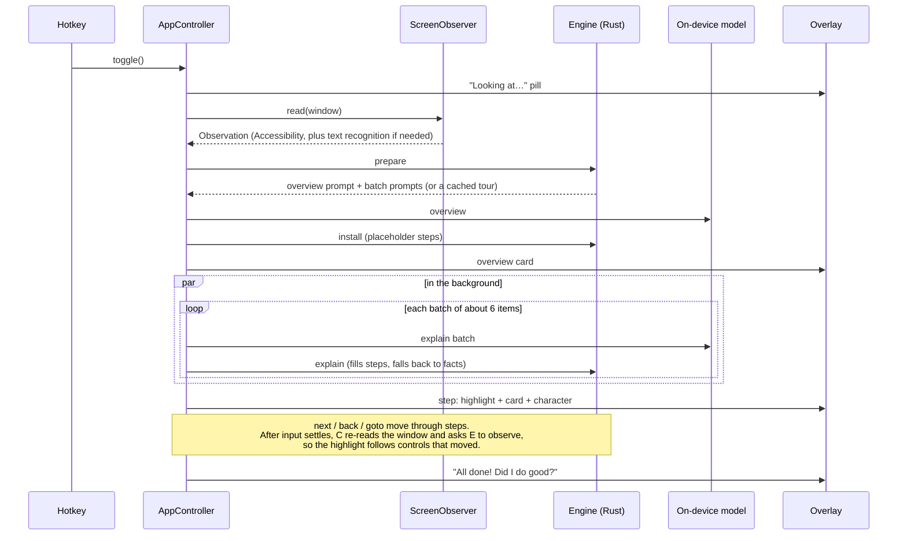

# Architecture

This is a guided tour of Nudge's code: how the pieces fit, how a guide flows through them, and where to make common changes. For the engine's wire format, see [PROTOCOL.md](PROTOCOL.md).

## The big picture

Nudge has two parts that talk over a private pipe:

- **The Mac app** (`Sources/Nudge/`), in Swift with SwiftUI and AppKit. It owns everything that touches macOS: reading windows, Apple's on-device model, the overlay, shortcuts, speech and settings.
- **The guide engine** (`engine/`), a small Rust program bundled inside the app. It has no platform code. It decides what to explain and in what order, writes the prompts, checks the model's answers against what's really on screen, and tracks where the tour is. The app starts it as a child process and talks to it in JSON lines over standard input and output. There is no port and no server.

Keeping the engine free of platform code means a Windows version could reuse it with its own screen reader, overlay and model.

## The Mac app, layer by layer

The app follows **MVVM**: views show state and send actions; view models hold state and decide what happens; models are plain data; services do the work with system frameworks.

| Folder | Role | Main types |
|---|---|---|
| `App/` | Entry point, menu bar item, command-line flags | `NudgeApp`, `AppDelegate` |
| `Models/` | Plain value types and persisted settings. No behavior beyond small conveniences. | `Observation`, `ObservedElement`, `UnitRect`, `GuidePlan`, `GuideState`, `GuideContent`, `GuideAppearance`, `Preferences`, `MascotMood` |
| `ViewModels/` | State and decisions. `AppController` runs a guide session; `GuideModel` is what the card and character display. | `AppController` (+ extensions), `GuideModel`, `FollowModel` |
| `Views/` | SwiftUI views. They read view models and send `GuideAction`s back. | `GuideCard`, `CardBackdrop`, `OverlayRoot`, `MainView`, `AppearanceSettings` |
| `Services/` | Work with system frameworks and the engine. No UI. | `ScreenObserver`, `LocalIntelligence`, `EngineBridge`, `Speaker`, `SoundEffects`, `FeedbackStore` |
| `Platform/` | AppKit windows and system hooks that host the views. | `Overlay`, `GuidePanel`, `AreaSelector`, `Hotkey` |
| `Support/` | Small extensions and logging | `Log`, `NudgeError` |
| `Brand/` | The character and icons, under the [brand license](../LICENSE-BRAND.md) | `MascotView`, `MascotArt` |

### `AppController`

`AppController` is the app's main view model. It's a `@MainActor ObservableObject` whose published properties drive the settings window, and it coordinates the services and the overlay during a guide. Its code is split across files by concern:

| File | What it covers |
|---|---|
| `AppController.swift` | Stored state, startup, global shortcuts, card actions, the settings window |
| `AppController+Guide.swift` | A guide session: starting, reading the window, the overview, steps, navigation, following the window, completion |
| `AppController+Feedback.swift` | "Did I do good?", the note box, and "Look again" |
| `AppController+WelcomeTour.swift` | The first-run tour of Nudge's own settings |
| `AppController+Setup.swift` | Permissions, launch at login and shortcuts |

A session moves through `Phase`: `idle` → `reading` → (`choosing`, in a browser) → `step` → `complete`, with `paused` whenever the person switches away.

### The overlay

`Overlay` draws everything that appears over other apps in one borderless, full-screen `GuidePanel` per display:

- A Core Animation **stage** holds the dimming, the highlight ring and its glow, and the frame around a chosen area. Moves between targets are spring-animated paths.
- A SwiftUI **`OverlayRoot`** holds the card and the character.
- A display link follows the explained window every frame, so the highlight and card move with it. The panel lets clicks through everywhere except over the card.
- Only while the feedback note box is open can the panel become key, so typing reaches it.

## How a guide flows

Here's what happens when someone presses <kbd>⌃</kbd><kbd>⇧</kbd><kbd>Space</kbd> in an app:

**Area mode** (<kbd>⌃</kbd><kbd>⇧</kbd><kbd>A</kbd>) is the same flow with a `region`. `AreaSelector` lets the person drag a box. `ScreenObserver.inspectArea` screenshots just that box, reads its text and finds and classifies its pictures with Vision. The engine keeps only what's inside the box, and orders the tour as controls, then pictures, then text blocks. Area tours skip the overview and start with the first item.

**Goal mode** (a typed goal) asks the model for only the next action. After the person does it and confirms, Nudge reads the new screen and asks again.

## Privacy by design

- The app has no networking code. Keep it that way: it's the first rule in [CONTRIBUTING.md](../CONTRIBUTING.md).
- Screen content lives in memory for the length of a guide. The engine's tour cache is in memory too, and expires after 20 minutes.
- Screen text reaches the model as data inside the prompt, and the model's instructions treat it as untrusted. The engine only accepts answers that point at items that were really observed.
- `FeedbackStore` writes the only file Nudge creates: `~/Library/Application Support/Nudge/Feedback.jsonl`.

## Where to make common changes

| To change… | Look in |
|---|---|
| How the card looks and its buttons | `Views/Guide/GuideCard.swift`, `Views/Guide/CardBackdrop.swift` |
| Where the card and character are placed; the highlight, dimming and area frame | `Platform/Overlay.swift` |
| Appearance options and their defaults | `Models/GuideAppearance.swift`, `Views/Settings/AppearanceSettings.swift` |
| Other settings and their defaults | `Models/Preferences.swift`, `Views/Settings/MainView.swift` |
| What's read from a window; text and picture recognition | `Services/ScreenObserver.swift` |
| The model's instructions and output shapes | `Services/LocalIntelligence.swift` |
| What's explained, in what order, grouping, prompts, fallbacks | `engine/src/` |
| Session behavior: steps, navigation, what happens when the screen changes | `ViewModels/AppController+Guide.swift` |
| The end-of-guide question | `ViewModels/AppController+Feedback.swift` |
| Sound effects | `Services/SoundEffects.swift` |
| The character | `Brand/` (brand licensed; please open an issue first) |
